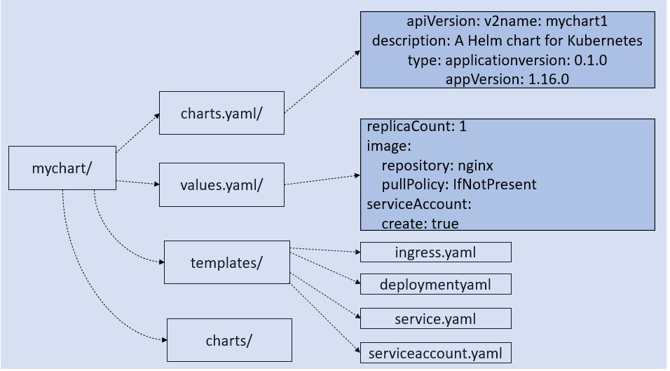

# Installing helm using debian repo

## Adding helm repo key
```shell
curl https://baltocdn.com/helm/signing.asc | gpg --dearmor | sudo tee /usr/share/keyrings/helm.gpg > /dev/null
```

## Adding helm repo
```shell
echo "deb [arch=$(dpkg --print-architecture) signed-by=/usr/share/keyrings/helm.gpg] https://baltocdn.com/helm/stable/debian/ all main" | sudo tee /etc/apt/sources.list.d/helm-stable-debian.list
```

## Updating repositories
```shell
sudo apt update
```

## Installation
```shell
sudo apt install helm
```


# Installing helm using webscript

```shell
curl -fsSL https://raw.githubusercontent.com/helm/helm/main/scripts/get-helm-3 | sudo bash
```


# HELM commands

## Repositories
### Adding
```shell
helm repo add <repoName> <URL>
```
### Update
```shell
helm repo update
```
### List
```shell
helm repo list
```
### Removing
```shell
helm repo remove <repoName>
```

## Searching charts in repositories
### Displaying all charts
```shell
helm search repo <repoName>
```
### Keyword
```shell
helm search repo <repoName> <keyword>
```

## Searching charts in ArtifactHUB
### Displaying all charts
```shell
helm search hub
```
### Keyword
```shell
helm search hub <keyword>
```

## Creating new chart
```shell
helm create <chartName>
```

## Chart structure


## Example chart service file
*(Chart is named **xd**)*
```yml
apiVersion: v1
kind: Service
metadata:
  name: {{ include "xd.fullname" . }}
  labels:
    {{- include "xd.labels" . | nindent 4 }}
spec:
  type: {{ .Values.service.type }}
  ports:
    - port: {{ .Values.service.port }}
      targetPort: http
      protocol: TCP
      name: http
  selector:
    {{- include "xd.selectorLabels" . | nindent 4 }}
```

## Chart validation
*(Should be run in chart directory)*
```shell
helm lint
```

## Chart installation
```shell
helm install <instanceName> <repo>/<chart>
```
If you have `values.yml` file, you can include it with `-f` switch:
```shell
helm install <instanceName> <repo>/<chart> -f <valuesFile>
```

## Exporting default values.yml file from chart
```shell
helm inspect values <repo>/<chart> > values.yml
```

## List of active instances
```shell
helm list
```

## Details about specific instance
```shell
helm status <instanceName>
```

## Updating values file in existing instance
```shell
helm upgrade <instanceName> <repo>/<chart> -f <file>
```

## Removing instance
```shell
helm delete <instanceName>
```
